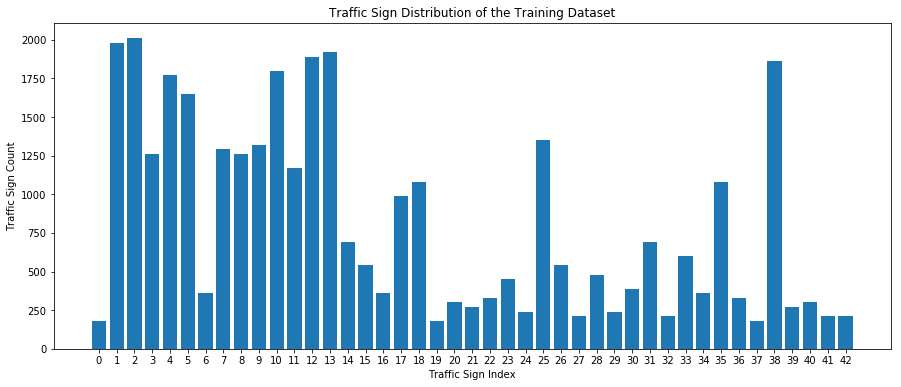
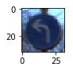
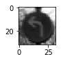
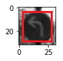
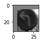
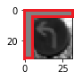
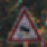
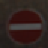
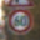
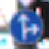

# Traffic Sign Recognition Writeup
---

## Build a Traffic Sign Classifier
The goals/steps of this project are the following:
* Load the datasets
* Explore, summarize and visualize the datasets
* Design, train and test a model architecture using the datasets
* Use the model to make predictions on new images
* Analyze the softmax probabilities of the new images
* Summarize the results with a written report

## Dataset Summary and Exploration

#### 1. Basic Summary of the Datasets
I used python, numpy and pandas library to calculate summary statistics of the traffic sign datasets:
* The size of the training set is 34799
* The size of the validation set is 4410
* The size of the test set is 12630
* The shape of a traffic sign image is (32, 32, 3)
* The number of unique classes/labels in the dataset is 43

#### 2. Exploratory Visualization of the Dataset
Here is an exploratory visualization of the training set. It is a bar chart showing how the data is distributed in the training set:

## Design and Test the Model Architecture

#### 1. Image Pre-processing and Augmenting

##### 1.1 Image Grayscaling and Normalization 
As a first step, I decided to convert the images to grayscale to improve the performance of the traffic sign classifier. A traffic sign can be identified by its shape or direction without the color, for example, a traffic sign that specifies "ahead only" can be easily identified by the straight arrow that points ahead. In some level the colors of the image can be seen as noises for the model. By converting RGB color images to grayscale images will greatly reduce the size of the data, which eventually improves the performance of the model.

There is a published document discussing about that using grayscale images instead of color increases the capacity of the network at:
http://yann.lecun.com/exdb/publis/pdf/sermanet-ijcnn-11.pdf

As a last step, I normalized the image data and made it zero-centered (-0.5 ~ 0.5) for these reasons:
- Helps the network to reduce the effect of scale differences
- The zero-centering is beneficial for ReLu (I used ReLu in the model) which will dropout the values that is under zero during the training
- The filters in the convolutional layer is randomly initialized and zero-centered as well, so zero-centering the images makes the training data consistent with the the initial value of the filters, which overall favors the speed of the learning process

There is an online discussion on this topic at:
https://www.quora.com/How-does-zero-centering-step-help-convolutional-neural-network

Here is an example of a traffic sign image before and after grayscaling and zero-centered normalization :

 

##### 1.2 Image  Augmenting
I decided to generate additional data because it will provide more valid data for the training, and make the model more focused on the actual features, which eventually makes the model more accurate.

To add more data to the the datasets, I used the following techniques because it will drop the noises and help the model to focus on the actual features:
- Clip out the noise pixels at top left by 15% and generate a new image
- Clip out the noise pixels at top right by 15% and generate a new image
- Clip out the noise pixels at bottom left by 15% and generate a new image
- Clip out the noise pixels at bottom right by 15% and generate a new image

Here is an example of an original image and the valid area of the features:

 

Here is an example of an original image and an augmented image with 15% top left pixels clipped out:

 

The difference between the original image and the augmented image is the following pixels (with the value 0.0) in the read box:

 

In the end, with all the augmented images, the datasets increased by a lot. The final datasets are as 5 times big as the original ones. Here are the sizes of final datasets:
* The size of the training set is 173995
* The size of the validation set is 22050
* The size of the test set is 63150

#### 2. Model Architecture
Here is a list of layers in the model architecture including model type, layers, layer sizes, connectivity, and etc. The model consisted of the following layers:

| Layer           | Description                                 |
| :-------------- | :------------------------------------------ |
| Input           | 32x32x1 Grayscale Images                    |
| Convolution 5x5 | 1x1 Stride, Valid Padding, Outputs 28x28x12 |
| ReLu            |                                             |
| Max pooling     | 2x2 Stride,  Outputs 14x14x12               |
| Convolution 5x5 | 1x1 Stride, Valid Padding, Outputs 10x10x24 |
| ReLu            |                                             |
| Max pooling     | 2x2 Stride,  Outputs 5x5x24                 |
| Flatten         | Outputs 600                                 |
| Fully Connected | Outputs 256                                 |
| Fully Connected | Outputs 128                                 |
| Softmax         | Outputs 43                                  |

#### 3. Optimizer and Hyperparameters 
To train the model, I used the AdamOptimizer. The hyperparameters that I used are:

| Hyperparameter | Value |
| :------------- | :---- |
| Epoch          | 30    |
| Batch Size     | 64    |
| Learning Rate  | 0.001 |

#### 4. Training the Model

##### 4.1 Final Results
Here is the results of my final model:

| Dataset        | Accuracy |
| :------------- | :------- |
| Training Set   | 99.9%    |
| Validation Set | 95.8%    |
| Test Set       | 93.7%    |

##### 4.2 LeNet as the Starting Point
LetNet is well known and comprehensive neural network model to start with. It's also easier to build using TensorFlow. It uses Convolutional Networks which have a great performance for image classification.

This article discussed about that using Convolutional Networks for traffic sign classification has a very good performance:
http://yann.lecun.com/exdb/publis/pdf/sermanet-ijcnn-11.pdf

So as a start, I used the LeNet model directly to classify the the original images, and the validation accuracy is around %88 ~ 91%, and test accuracy is a little bit lower. I increased the number of filters for the convolutional layers and adjusted the units of the fully connected layers because the images I am going to classify has much more classes than the digital classifier that the LeNet was originally used for. Here the traffic signs have 43 different of labels, but the digital images has only 10 labels (or digits). And that does bring a positive impact on the accuracy. It made the accuracy increased a little bit.

After that, I tried other several adjustments on the model to improve the accuracy as described in following, and got some better results as you see in the final results table above.

##### 4.3 Improvement Using Grayscaling and Normalization
Using grayscale images instead of color images made the accuracy increased by 0.5% ~ 1%. Well using the normalization brought in another slight incensement by less than 0.5%, not as much as expected, but it does have a positive impact. This is a topic that is worth more study for me.

##### 4.4 Experiment on the Hyperparameters
At the beginning, the hyperparameters that I used are:

| Hyperparameter | Value |
| :------------- | :---- |
| Epoch          | 5     |
| Batch Size     | 128   |
| Learning Rate  | 0.01  |

The results are not so good because the result is less than 90%. And after that, I tried several adjustments on the model to improve the accuracy as described in following, and got some better results as you see in the table with the final results.

**Epochs**: After training the model for more than 100 epochs, the accuracy increased slightly by less than 2%. The increasing seems really slow or appears to stop after 100 epochs. Apparently, that's not the direction to go, because running so many epochs is really time consuming and resource consuming, which is inefficient. Usually, 30 epochs is a good enough for us, we have to explore other ways for improvement. So I started to try other adjustments on the model. 

**Batch Size**: The accuracy increased slightly by less than 1% after reduce the batch size from 128 to 64. I noticed that it takes a little bit more time to finish an epoch after reducing the batch size. I think one reason is that it needs to run more loops to finish the whole training set, and more loops usually need more time. Fortunately, the extra time consumption is not too much, it is acceptable so far. So I chose 64 as the batch size in the end.

**Learning Rate**: I noticed that using a high learning rate like 0.01 will let the model reaches the highest accuracy quickly, and a low learning rate like 0.001 slowly. A high learning rate appears to make the final accuracy bump around the final result a lot. A low learning rate appears to make the final accuracy less bumpy and more smooth. So I chose 0.001 as the learning rate.

Here is an overall summary on my experiments with the hyperparameters:

| Hyperparameter | Experiments   | Accuracy    | Side Effect         | Final Choice |
| :------------- | :------------ | :---------- | :------------------ | :----------- |
| Epoch          | 5 -> 200      | Increase    | More time/resources | 30           |
| Batch Size     | 128 -> 64     | Increase    | More time           | 64           |
| Learning Rate  | 0.01 -> 0.001 | More smooth | More time           | 0.001        |

##### 4.5 Training with Augmented Images
Surprisingly, adding the augmented images to the datasets has a much more positive impact on the accuracy than adjusting the hyperparameters. After using the augmented images, the accuracy increased by about 1.5% ~ 2.5%, which is a really good achievement considering what we've got with the hyperparameter experiments.

##### 4.6 Summary
Finally, by adding the augmented images and with the chosen hyperparameters on the adjusted LeNet model, I got validation accuracy at 95.8%, and a test accuracy at 93.7%.

## Test the Model on New Images

#### 1. New Images
Here are five German traffic signs (80x80x3) downloaded from the web:

       

The second image might be difficult to classify because it's a little bit too dark. It's even a little bit difficult for human to recognize at the first glance. The darkness of all the pixels could be a big noise for the classification.

The third image might be difficult to classify because it's a little bit too blur and it has a another sign at the top, both of which are noises for the classification.

All the images have colors, and the sizes don't match the model, so I manually scaled them into (32x32x3) color images, and then use python code to convert them into (32 x 32 x 1) grayscale images with zero-centered normalization before the actual classification.

#### 2. Predictions
Here are the results of the predictions:

| Test Image   | Ground Truth         | Prediction           |
| :----------- | :------------------- | :------------------- |
| Test Image 1 | Slippery road        | Slippery road        |
| Test Image 2 | No entry             | No entry             |
| Test Image 3 | Speed limit (60km/h) | Speed limit (60km/h) |
| Test Image 4 | Go straight or right | Go straight or right |
| Test Image 5 | Ahead only           | Ahead only           |

The model was able to correctly predict all the 5 traffic signs, which gives an accuracy of 100%. This compares favorably to the accuracy on the test set of 93.7%.

#### 3. Certainty of the Predictions 

The code for making the predictions on my final model is located in the section "Output Top 5 Softmax Probabilities For Each Image Found on the Web" in the Ipython notebook. The cell with the python code is marked as "In [48]". Not sure why it is not following the indexing of the cells, it's probably following the order of how I run the cells. Notice, I have saved the model after the training and testing, and then made some small clean up on the code for dataset visualization and pre-processing. At the end, I loaded up the the saved model and then made the predictions.

For the first image, the model is relatively sure that this is a slippery road sign (probability of 0.999), and the image does contain a slippery road sign. The top five softmax probabilities were:

| Probability | Prediction                                   |
| :---------- | :------------------------------------------- |
| 0.99999571  | Slippery road                                |
| 0.00000424  | Dangerous curve to the left                  |
| 0.00000000  | Double curve                                 |
| 0.00000000  | Wild animals crossing                        |
| 0.00000000  | No passing for vehicles over 3.5 metric tons |

For the 5th image, the model is relatively less sure that this is a ahead only sign (probability of 0.998), and the image does contain a ahead only sign. The top five soft max probabilities were:

| Probability | Prediction       |
| :---------- | :--------------- |
| 0.99899644  | Ahead only       |
| 0.00099603  | No passing       |
| 0.00000391  | Turn right ahead |
| 0.00000367  | Yield            |
| 0.00000003  | No vehicles      |

But 0.998 is a prediction with a pretty high confidence, so, this is a good prediction as well, I believe. The other images got similar softmax probabilities like these two. I can see that "winner takes all" because the highest probability is much more higher than the other probabilities.